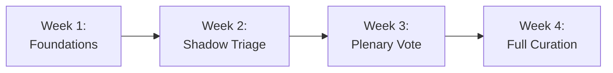

# Welcome to the OpenShelf Library Council 🏛️
*The Official Onboarding Guide & Council Welcome Pack*

---

> *"OpenedShelf does not map how a book feels; it maps what a book is. Our discovery engine relies on absolute mathematical precision. If our taxonomy degrades into subjective opinions, the engine breaks."*  
> — **OpenedShelf Taxonomy Governance Protocol**

---

## Welcome, Council Member!

Congratulations and welcome to the **OpenShelf Library Council**!

> [!TIP]
> **Start Here with a Personal Note:**  
> Before diving into bylaws and database schemas, please read [A_PERSONAL_WELCOME_FROM_ANITA.md](./A_PERSONAL_WELCOME_FROM_ANITA.md) — a personal welcome from OpenedShelf creator Anita Ruetz on community, friendship, pets, and why your voice matters here.

By accepting this role, you have become one of the foundational stewards of a global, public-domain literary taxonomy. Unlike commercial book platforms whose recommendation engines are optimized to feed users into advertising loops, sponsored placements, and algorithmic popularity traps, OpenedShelf is built on set theory, Boolean intersection, and radical transparency.

We exist to serve the reader at the margins:
1. **The Infrastructure-Constrained Reader** accessing knowledge over metered networks on older hardware.
2. **The Hyper-Specific Discoverer** looking for the exact intersection of narrative facts rather than bestseller lists.
3. **The Algorithmically Marginalized Reader** searching for #OwnVoices, indie works, and specific cultural narratives that corporate recommendation loops bury.
4. **The Data-Conscious Reader** who demands absolute privacy without behavioral tracking, cookies, or mandatory user accounts.

As a Council Member, you are the human heart of this system. Algorithms cannot evaluate whether a narrative device is an authentic plot fact or a publisher marketing buzzword. **You do.**

---

## What Is the Library Council?

The Library Council is the democratic, community-driven curation and governance body responsible for maintaining the accuracy, taxonomy integrity, and mathematical precision of OpenShelf. 

Rather than permitting unchecked crowdsourced tag sprawl or relying on black-box machine learning models that hallucinate tropes, OpenShelf entrusts curation to genre-literate readers, librarians, authors, and researchers.

### Your Core Responsibilities

1. **Genre Stewardship**: Monitor user-submitted tag proposals within your assigned domain(s) of expertise.
2. **Triage & Verification**: Verify factual claims in tag submissions via the Librarian Queue (`/verify`).
3. **Weekly Plenary Voting**: Participate in the weekly vote on promoted Thematic Tags and cross-genre promotions.
4. **Radical Transparency**: Ensure that every single veto is accompanied by a clear, educational, public written rationale.

---

## The Welcome Pack: Document Index

This welcome directory has been curated to provide every document, standard, and rubric you need to step into your role with confidence. Please review the documents in the following order:

| File | Title | Description |
| :--- | :--- | :--- |
| [A_PERSONAL_WELCOME_FROM_ANITA.md](./A_PERSONAL_WELCOME_FROM_ANITA.md) | **Personal Note from Anita** | A warm welcome from the creator on community, friendship, open dialogue, pets, and safe creative spaces. |
| [01_COUNCIL_CHARTER_AND_BYLAWS.md](./01_COUNCIL_CHARTER_AND_BYLAWS.md) | **Council Charter & Bylaws** | The constitutional charter, council roles, voting thresholds, quorum, and transparent veto mandates. |
| [02_TAXONOMY_GOVERNANCE_AND_SOP.md](./02_TAXONOMY_GOVERNANCE_AND_SOP.md) | **Taxonomy Governance & SOP** | The 3-tier taxonomy system, prefixes (`genre:`, `lang:`, `author:`, `year:`), formatting rules, and promotion criteria. |
| [03_TAG_EVALUATION_RUBRIC_AND_DECISION_MATRIX.md](./03_TAG_EVALUATION_RUBRIC_AND_DECISION_MATRIX.md) | **Evaluation Rubric & Matrix** | The "Fact Over Feeling" doctrine, the Essay Rule, and 30+ side-by-side examples of accepted vs. rejected tags. |
| [04_MODERATION_WORKFLOW_AND_TOOLING_GUIDE.md](./04_MODERATION_WORKFLOW_AND_TOOLING_GUIDE.md) | **Moderation Workflow & Tools** | How to use `/verify`, D1 moderation database tables, dispute resolution, and offline pipeline synchronization. |
| [05_VETO_WRITING_GUIDE_AND_TRANSPARENCY_TEMPLATES.md](./05_VETO_WRITING_GUIDE_AND_TRANSPARENCY_TEMPLATES.md) | **Veto Writing & Templates** | Why vetoes require written rationales, tone guidelines, and copy-paste templates for standard veto scenarios. |
| [06_READING_LIST_AND_PHILOSOPHICAL_FOUNDATIONS.md](./06_READING_LIST_AND_PHILOSOPHICAL_FOUNDATIONS.md) | **Philosophical Foundations** | The OpenShelf Manifesto, *1913* inspiration, library science principles, and our CC0 / AGPLv3 legal commitments. |
| [07_COUNCIL_FAQ_AND_QUICK_REFERENCE.md](./07_COUNCIL_FAQ_AND_QUICK_REFERENCE.md) | **FAQ & Quick Reference** | Common member dilemmas, edge cases (spoilers, author self-tagging), syntax cheat sheet, and key contacts. |

---

## 30-Day New Member Onboarding Roadmap

To ensure a smooth transition without feeling overwhelmed, we recommend pacing your first month along this trajectory:

### Week 1: Foundations & Orientation
- [ ] Read [01_COUNCIL_CHARTER_AND_BYLAWS.md](./01_COUNCIL_CHARTER_AND_BYLAWS.md) and [02_TAXONOMY_GOVERNANCE_AND_SOP.md](./02_TAXONOMY_GOVERNANCE_AND_SOP.md).
- [ ] Read the original [OpenedShelf Manifesto](../docs/OpenedShelf_manifesto.md) and [The Reader's Primer](../docs/OpenedShelf_reader.md).
- [ ] Introduce yourself to fellow council members in the Council channel and confirm your designated genre domain(s).
- [ ] Browse the live site ([openedshelf.org](https://openedshelf.org)) and test several multi-tag Boolean intersections and "Rabbit Hole" zero-result gaps.

### Week 2: Shadow Triage & Tag Evaluation
- [ ] Study [03_TAG_EVALUATION_RUBRIC_AND_DECISION_MATRIX.md](./03_TAG_EVALUATION_RUBRIC_AND_DECISION_MATRIX.md).
- [ ] Visit the Librarian Verification Queue at [`/verify`](../src/ui/pages/verify.js).
- [ ] Review pending submissions in your designated genre alongside an experienced Council Member or Lead.
- [ ] Practice applying the "Fact Over Feeling" test to pending tag proposals.

### Week 3: Your First Plenary Voting Cycle
- [ ] Review [04_MODERATION_WORKFLOW_AND_TOOLING_GUIDE.md](./04_MODERATION_WORKFLOW_AND_TOOLING_GUIDE.md).
- [ ] Participate in the weekly Friday–Saturday plenary council vote.
- [ ] Cast your first votes on proposed Tier 1 Thematic promotions (`yes`, `no`, or `abstain`).

### Week 4: The Written Veto & Full Autonomy
- [ ] Read [05_VETO_WRITING_GUIDE_AND_TRANSPARENCY_TEMPLATES.md](./05_VETO_WRITING_GUIDE_AND_TRANSPARENCY_TEMPLATES.md).
- [ ] If encountering a tag proposal that violates our objective criteria, draft a written veto using our standardized templates.
- [ ] Review the published Sunday Council Digest to see your approved tags compiled into the pipeline update.
- [ ] Celebrate! You are now a fully certified, active OpenShelf Council Member.

---

## Workspace Quick Links & Key Files

For reference, the OpenShelf technical and governance repositories contain several foundational source files:
- **Taxonomy Protocol**: [docs/OpenedShelf_TGP.md](../docs/OpenedShelf_TGP.md)
- **Manifesto**: [docs/OpenedShelf_manifesto.md](../docs/OpenedShelf_manifesto.md)
- **Search & Reader Guide**: [docs/OpenedShelf_reader.md](../docs/OpenedShelf_reader.md)
- **Moderation Database Schema**: [db/d1_moderation_schema.sql](../db/d1_moderation_schema.sql)
- **Librarian Verification Queue UI**: [src/ui/pages/verify.js](../src/ui/pages/verify.js)
- **Launch Playbook & HN Manifesto**: [docs/LAUNCH_COPY_AND_PLAYBOOK.md](../docs/LAUNCH_COPY_AND_PLAYBOOK.md)

---

*Thank you for lending your passion, knowledge, and integrity to OpenShelf. Together, we are building an enduring public commons for the world's literature.*
