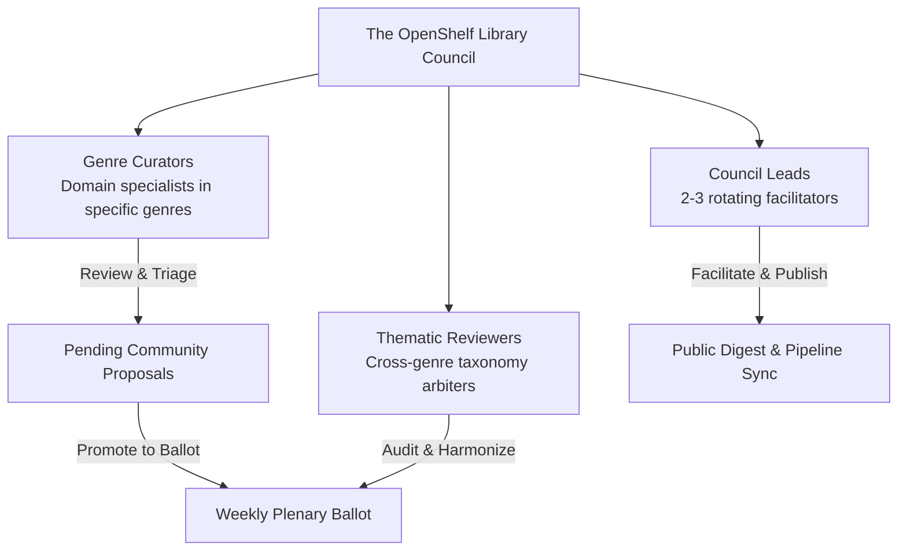
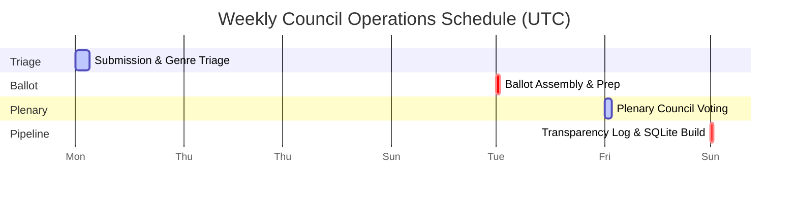

# OpenShelf Library Council Charter & Governance Bylaws

---

## Article I: Foundation & Purpose

### Section 1.1: Institutional Authority
The **OpenShelf Library Council** (the "Council") is established as the autonomous, community-driven curation and governing authority for the taxonomy, classification schemas, and verification pipelines of OpenShelf. 

### Section 1.2: Core Mandate
The Council's foundational objective is to maintain an **objective, mathematically precise literary taxonomy** dedicated entirely to the public domain under the **Creative Commons CC0 1.0 Universal Public Domain Dedication**. 

The Council operates under the following immutable tenets:
1. **Fact Over Feeling**: The database maps verifiable textual realities (e.g., plot devices, points of view, historical settings, narrative structures), never subjective quality judgments or personal reactions.
2. **Strict Boolean Integrity**: Tags exist to empower set-theoretic discovery (`AND`, `OR`, `NOT`). The Council guards against taxonomy inflation, semantic duplication, and vague categorizations that degrade search precision.
3. **Public Stewardship**: All taxonomy decisions, promotion votes, and veto rationales are public record. The Council operates in full daylight with zero hidden curation algorithms.
4. **Anti-Monopoly & Privacy**: The Council champions the reader at the margins—protecting private exploration without surveillance, accounts, or corporate monetization.

---

## Article II: Council Roles & Structure

### Section 2.1: Genre Curators
* **Appointment**: Curators are accepted based on demonstrated reading history, scholarship, librarianship, or community expertise in specific genres (e.g., *Science Fiction*, *Romance*, *Mystery/Thriller*, *Historical Fiction*, *Non-Fiction*).
* **Duties**:
  * Triage pending community tag submissions within their assigned genre shelves.
  * Verify factual claims using textual evidence or reliable bibliographic references.
  * Nominate high-value, recurring genre tropes for promotion to Thematic Tags.

### Section 2.2: Thematic Reviewers
* **Appointment**: Senior or cross-genre council members with deep familiarity with library science (BISAC, LCGFT, Dewey, Ranganathan's Laws).
* **Duties**:
  * Harmonize Tier 1 Thematic Tags across different genres.
  * Audit tag naming conventions (snake_case, singular/plural consistency, avoidance of lexical overlap).
  * Review semantic collisions and cross-disciplinary concepts.

### Section 2.3: Council Leads
* **Appointment**: Rotated semi-annually among experienced Council members.
* **Duties**:
  * Facilitate the weekly voting schedule and assemble the weekly voting ballot.
  * Administer dispute resolution for contested tags.
  * Compile and publish the weekly **Public Transparency Digest & Veto Log**.
  * Trigger and oversee the weekly offline database compilation pipeline.

---

## Article III: The Weekly Governance & Voting Cycle

The Council operates on a strict 7-day cyclical calendar to ensure consistent updates for the global OpenShelf catalog:

### Day 1–4 (Monday 00:00 UTC – Thursday 23:59 UTC): Submission & Domain Triage
1. Community users submit tag proposals via the OpenShelf UI (`/search`, `/shelf`, `/book`).
2. Submissions populate the transactional `Pending_Tags` table in Cloudflare D1.
3. Genre Curators monitor their respective queues in `/verify`.
4. Curators review each submission:
   - For standard additions of known tags: Curators verify factual textual alignment.
   - For proposed new tags or cross-genre expansions: Curators mark the proposal for plenary council review.

### Day 5 (Friday 00:00 UTC – Friday 23:59 UTC): Ballot Assembly
1. Council Leads review all proposals marked for council voting.
2. The Leads compile the weekly ballot, which includes:
   - All proposed **Tier 1 Thematic Tags**.
   - All **Tier 3 Genre Tropes** eligible for promotion to Tier 1 under the 3-Genre Rule.
   - All unresolved **Disputed Tags** from the previous week.
3. The ballot is published internally to Council members with supporting citations.

### Day 6 (Saturday 00:00 UTC – Saturday 18:00 UTC): Plenary Council Vote
1. All active Council members cast their votes using the moderation platform:
   - **`yes`**: Endorse tag adoption or promotion.
   - **`no`**: Disagree with proposed adoption or taxonomy placement.
   - **`abstain`**: Neutral or lack of familiarity with the referenced texts.
   - **`veto`**: Constitutional objection based on taxonomy criteria (mandates written rationale).
2. Voting closes promptly at 18:00 UTC on Saturday.

### Day 7 (Saturday 18:00 UTC – Sunday 12:00 UTC): Transparency & Pipeline Sync
1. Votes are tabulated.
2. All vetoes and rejections are compiled into the public **Transparency Digest**.
3. Council Leads certify the approved tag set.
4. The approved changes are exported and built into the next immutable catalog dump via `run_pipeline.sh` and deployed globally to Cloudflare R2 edge storage.

---

## Article IV: Voting Thresholds & The Veto Charter

### Section 4.1: Quorum
A weekly plenary vote requires participation from at least **40% of active Council members** to achieve quorum. If quorum is not met, non-urgent promotion items carry over to the subsequent weekly cycle.

### Section 4.2: Standard Approval Thresholds
* **Routine Tag Verifications**: Require **three (3) independent, unanimous approvals** from verified Librarians / Curators.
* **New Tier 3 Tropes**: Require a simple majority (> 50%) of voting Council members.
* **Tier 1 Thematic Tag Promotions**: Require a **two-thirds (66.7%) supermajority** of voting Council members.

### Section 4.3: The Constitutional Veto Charter
Any Council member may exercise a **Constitutional Veto** against a proposed tag or promotion if the proposal violates our core taxonomy principles.

#### The Mandatory Rationale Rule
> [!IMPORTANT]
> Per the OpenShelf database architecture (`db/d1_moderation_schema.sql`), the `rationale` field in `Council_Votes` is **strictly required** whenever `vote = 'veto'`. A veto cast without an explicit, verifiable written rationale is mathematically invalid and will be rejected by the database constraint.

#### Valid Grounds for a Veto:
1. **Subjectivity Violation**: The tag expresses reader opinion, emotional reaction, or value judgment rather than verifiable textual fact (e.g., `boring`, `beautifully_written`, `suspenseful`).
2. **Semantic Ambiguity / The Essay Rule**: The tag cannot be defined in a single objective sentence and requires lengthy essays to defend its presence.
3. **Lexical Duplication**: The concept is already accurately mapped by an existing canonical tag.
4. **Scope Violation**: The tag attempts to define a temporary sub-plot nuance rather than a pervasive narrative or structural element.

#### Overriding a Veto
A vetoed tag may be brought before the Council for reconsideration only if:
1. New textual evidence or a revised, compliant definition is submitted that directly addresses the vetoing member's written objection; AND
2. The revised proposal secures an **eighty percent (80%) supermajority** vote of the entire active Council.

---

## Article V: Dispute Resolution & The Quarantine Protocol

When readers or curators disagree on whether a factual element exists within a text:
1. **Quarantine**: The tag enters `status = 'disputed'`. While under dispute, the tag is temporarily excluded from public Boolean search intersections to preserve catalog integrity.
2. **Textual Verification**: The author of the proposal and the disputant submit specific page citations, ISBN editions, or textual quotes.
3. **Arbitration**: A panel of three (3) Genre Curators not involved in the original dispute reviews the textual evidence.
4. **The Tie-Breaker Doctrine**: If a factual element remains genuinely ambiguous or subject to competing literary interpretations, the tag is **rejected**. In OpenShelf set theory, false negatives are far preferable to false positives.

---

## Article VI: Ethics, Conduct & Anti-Gatekeeping

### Section 6.1: Neutrality & Anti-Censorship
OpenShelf is an objective map of human literature. The Council shall never veto, suppress, or modify tags to obscure controversial themes, unpopular opinions, or challenging historical texts. Our role is strictly descriptive, never prescriptive or censorious.

### Section 6.2: Championing Marginalized Voices
The Council pays special vigilance to works from historically underrepresented writers, indie publishers, and marginalized communities (#OwnVoices, translation literature, small presses). Curators must ensure that genre definitions do not inadvertently exclude non-Western narrative structures or culturally distinct storytelling traditions.

### Section 6.3: Conflicts of Interest
Council members must declare a conflict of interest and abstain from voting on:
* Books authored, published, or edited by themselves, immediate family, or business partners.
* Commercial promotional campaigns where financial compensation is involved.

---

## Article VII: Membership Status & Sabbaticals

### Section 7.1: Active Status
A Council member maintains "Active Status" by participating in at least three (3) weekly triage sessions or plenary votes within any rolling six-week window.

### Section 7.2: Sabbaticals & Leaves of Absence
Council members are volunteers and book lovers with full lives. Members may request a sabbatical of up to six (6) months at any time simply by notifying the Council Leads. Sabbatical members do not count toward quorum calculations and may resume active duties whenever ready.

---

*Adopted by the OpenShelf Governance Community. Governed by the AGPLv3 Code License and CC0 1.0 Public Domain Taxonomy.*
