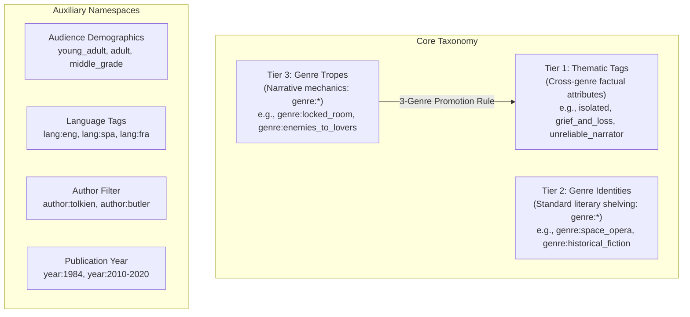
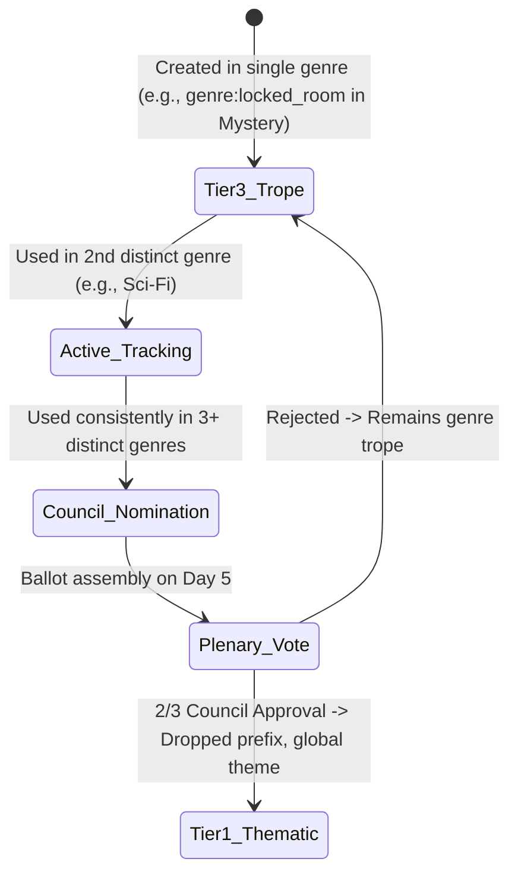
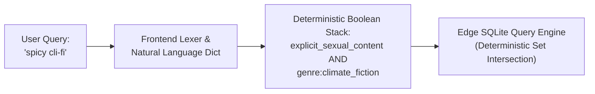

# OpenShelf Taxonomy Governance & Standard Operating Procedure (SOP)

---

## 1. The Prime Directive: Fact Over Feeling

The foundational premise of OpenedShelf is mathematical determinism. Our discovery engine performs strict set-theoretic Boolean intersections (`AND`, `OR`, `NOT`). 

If a reader queries:
```text
isolated AND resource_scarcity AND genre:space_opera NOT violent_content
```
The query service executes a pure intersection across indexed database junction tables. It does not calculate probabilistic cosine distances or score books on subjective user sentiment. 

> [!IMPORTANT]
> **The Prime Directive**: Every tag in the OpenShelf taxonomy must represent an **Objective Factual Property** of the text. 
> 
> A tag must answer a binary factual question verifiable by any reader who opens the book:
> *"Does this text contain [Proposed Element]?"*

If an element depends on personal taste, reading mood, emotional sensitivity, or aesthetic appreciation, it is **subjective** and must be barred from the database index.

| Type | Examples | Council Ruling | Rationale |
| :--- | :--- | :--- | :--- |
| **Objective Fact** | `first_person_pov`, `arranged_marriage`, `hydroponic_agriculture`, `locked_room`, `dual_timeline`, `epistolary` | **APPROVED** | Demonstrable on the physical page. Two independent readers will verify the exact same fact. |
| **Subjective Feeling** | `heartwarming`, `spooky`, `boring`, `page_turner`, `deep_world_building`, `overrated`, `poetic` | **REJECTED** | Varies by reader threshold, cultural background, and emotional state. Destroys Boolean search precision. |

---

## 2. The Three-Tier Taxonomy Hierarchy

OpenShelf organizes literary concepts into three distinct tiers, complemented by specialized metadata namespaces:



### Tier 1: Thematic Tags (Cross-Genre Factual Properties)
* **Database Representation**: No prefix (e.g., `isolated`, `resource_scarcity`, `first_person_pov`, `coming_of_age`, `grief_and_loss`, `found_family`).
* **Scope**: Universal. These tags apply across fiction and non-fiction alike, regardless of genre.
* **Governance**: Strictly governed by the full Library Council through weekly plenary voting.

### Tier 2: Genre Identities (Standard Literary Shelving)
* **Database Representation**: Prefixed with `genre:` (e.g., `genre:science_fiction`, `genre:space_opera`, `genre:cozy_mystery`, `genre:biography_memoir`, `genre:cookbooks`).
* **Scope**: Defines the primary structural and industry classification where the physical work would be shelved in a library or bookstore.
* **Standardization**: Aligned with internationally recognized bibliographic standards:
  - **BISAC** (Book Industry Standards and Communication)
  - **LCGFT** (Library of Congress Genre/Form Terms)
* **Governance**: Maintained by Thematic Reviewers and Council Leads to prevent arbitrary genre sprawl.

### Tier 3: Genre Tropes (Verifiable Narrative Devices)
* **Database Representation**: Prefixed with `genre:` (e.g., `genre:locked_room`, `genre:enemies_to_lovers`, `genre:litrpg`, `genre:generation_ship`, `genre:fake_dating`).
* **Scope**: Specific storytelling conventions, character archetypes, or narrative devices that recur within particular literary traditions.
* **Governance**: Curated directly by domain-specific **Genre Curators** who understand the nuance of their specific community.

---

## 3. The 3-Genre Trope Promotion Pipeline

One of the Library Council's most critical responsibilities is managing the evolution of tropes into universal themes.



### How Promotion Works:
1. **Detection**: When a Tier 3 trope (e.g., `genre:locked_room`) is verified across works belonging to **three (3) or more distinct parent genres** (e.g., *Mystery*, *Science Fiction*, and *Historical Fiction*), the system flags the tag for promotion.
2. **Nomination**: A Genre Curator or Thematic Reviewer files a formal promotion proposal before the Friday ballot.
3. **Plenary Council Vote**: The full Council votes on whether the concept has transcended its genre origins to become a universal literary device.
4. **Graduation**: Upon receiving a 2/3 supermajority vote:
   - The tag sheds its `genre:` prefix and becomes a top-level Tier 1 Thematic Tag (e.g., `locked_room`).
   - The backend alias migration preserves historical bookmarks and queries seamlessly.

---

## 4. Auxiliary Namespaces & Prefixes

In addition to the three core taxonomy tiers, OpenShelf supports four specialized namespaces:

### 4.1 Audience & Demographic Qualifiers
Audience tags represent reader demographic targets and function alongside Tier 1 thematic tags without prefixes:
* `adult`
* `young_adult`
* `new_adult`
* `middle_grade`
* `childrens`

### 4.2 Language Filtering (`lang:`)
Language codes use the `lang:` prefix followed by the standard **ISO-639-3** three-letter lowercase identifier:
* `lang:eng` (English)
* `lang:spa` (Spanish)
* `lang:fra` (French)
* `lang:deu` (German)
* `lang:jpn` (Japanese)

### 4.3 Author Tracking (`author:`)
Author filters use the `author:` prefix (e.g., `author:tolkien`, `author:leguin`, `author:butler`). 
* *Technical Note*: Unlike taxonomy tags, author queries bypass junction tables and apply high-speed indexed filters against primary bibliographic metadata tables.

### 4.4 Publication Year Filtering (`year:` or `y:`)
Allows filtering by exact year or historical range:
* `year:1984`
* `year:2010-2020`
* `y:1913`
* *Metadata Provenance*: Publication year data is parsed strictly from **Library of Congress (LOC) MARC datasets** (control field `008` and tags `260`/`264`).

---

## 5. Tag Formatting & Syntax Standards

To maintain clean database operations and avoid URL parsing bugs across edge nodes, all proposed tags must adhere to strict formatting rules:

1. **snake_case Only**: All tags must be lowercase alphanumeric strings separated by single underscores.
   - **Correct**: `time_travel`, `unreliable_narrator`, `enemies_to_lovers`
   - **Incorrect**: `TimeTravel`, `time-travel`, `time travel`, `time_travel!`
2. **Singular vs. Plural Conventions**:
   - **Structural concepts and settings are singular**: `isolated_setting`, `first_person_pov`, `resource_scarcity`.
   - **Interpersonal dynamics and relationship tropes are plural**: `enemies_to_lovers`, `reluctant_allies`, `rivals_to_lovers`.
3. **No Punctuation**: No hyphens, apostrophes, slashes, or quotation marks.
4. **No Marketing Buzzwords**: Avoid buzzwords like `bestseller`, `spicy`, `must_read`, `masterpiece`.
5. **No Negative Tags**: We do not create tags prefixed with `no_` or `anti_`. Boolean search handles exclusion natively using `NOT` or `-` (e.g., readers query `NOT violent_content` rather than a tag named `no_violence`).

---

## 6. The Natural Language Translation Dictionary

Readers often query platforms using colloquial expressions rather than formal taxonomy tags (e.g., searching for "spicy romance", "whodunit", or "cli-fi"). 

Rather than polluting the CC0 database taxonomy with informal slang, OpenShelf decouples user search input from internal database tags via the **Natural Language Translation Dictionary**:



### Council Role in Dictionary Curation:
When reviewing user proposals, if a suggested tag is popular slang for an existing factual property:
1. **Do not create a duplicate database tag.**
2. Recommend adding the slang term to the frontend translation dictionary mapping to the canonical tag.
3. *Example*: "whodunit" maps to `genre:mystery` + `puzzle_plot`.

---

## 7. Technical Seeding & Regex Safety Rules

When approved tags are merged into the offline catalog build (`run_pipeline.sh`), they are populated through two primary mechanisms:

### 7.1 Explicit Seeding (`seed_mappings.js`)
* **Strictly for Seminal Works**: Hardcoded ISBN, title, and author combinations for benchmark titles.
* **Tight Author Matching**: Never map using common last names alone (`King`, `Herbert`). Always use full names (`Stephen King`, `Frank Herbert`).
* **Conjunctions for Broad Titles**: Combine short titles with author clauses (`title LIKE '%Dune%' AND author LIKE '%Frank Herbert%'`).

### 7.2 Dynamic Keyword Dictionaries (`tags_*_keywords.js`)
* **Word Boundaries (`\b`)**: All keyword patterns are compiled into regexes with boundary assertions.
* **Dual Vocabulary**: Ensure inclusion of both Library of Congress formal terms (e.g., `"climatic changes fiction"`) and established colloquial terms (e.g., `"cli-fi"`).

---

*This SOP is binding on all OpenShelf verification queues and Library Council voting cycles.*
