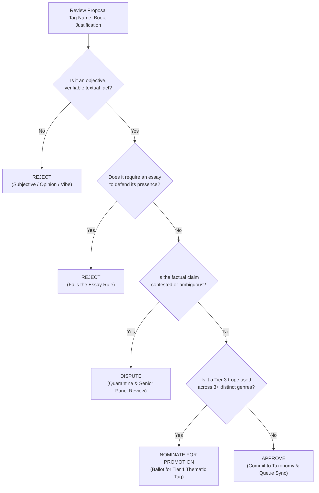

# OpenShelf Tag Evaluation Rubric & Decision Matrix

---

## 1. The Decision Matrix

When reviewing a community tag proposal in the Librarian Verification Queue (`/verify`), every Council member must evaluate the submission against this four-way decision matrix:

| Decision | Criteria | Action Taken |
| :--- | :--- | :--- |
| **APPROVE** | Represents a verifiable, objective textual fact. Follows formatting rules (`snake_case`). Proper tier assigned. Clear textual evidence provided. | Commit approval. Requires 3 independent curator approvals to fold into next offline build. |
| **REJECT** | Fails the objective fact test (subjective opinion, reading mood, quality judgment, marketing buzzword), fails the Essay Rule, or is a lexical duplicate. | Mark as rejected. If vetoed during plenary voting, **mandatory written rationale** must be provided. |
| **DISPUTE** | Readers or curators disagree on whether a factual plot point occurred in the text, or edition/translation differences exist. | Flag as `disputed`. Quarantined immediately from Boolean search. Referred to 3-curator arbitration panel. |
| **PROMOTE** | A validated Tier 3 Genre Trope that has demonstrated consistent, verifiable usage across 3 or more distinct parent genres. | Nominate for Friday plenary council ballot for promotion to Tier 1 Thematic Tag. |

---

## 2. The Two Guiding Tests

### Test 1: The Verification Pivot
Never ask: *"Do I like this tag?"* or *"Do I feel this book matches this vibe?"*  
Always ask: **"Does this book verifiably contain [Proposed Element]?"**

If any two reasonable readers reading the exact same chapter would answer "Yes", it is an objective fact. If their answers depend on their personal tastes or reading background, it is subjective.

### Test 2: The Essay Rule
> [!IMPORTANT]
> **The Essay Rule**: *If a tag requires an essay to justify, it is not an objective fact. Discard it.*
> 
> Valid tag justifications must be concise and factual. If a submitter has to write three paragraphs explaining why a character's internal monologue is "thematically adjacent" to a trope, the connection is too loose to serve as a Boolean search anchor.

---

## 3. Side-by-Side Evaluation Rubric (30+ Canonical Examples)

### A. Setting & World Elements
| Proposed Tag | Proposed For | Ruling | Rationale & Guidance |
| :--- | :--- | :--- | :--- |
| `isolated_setting` | *The Shining* by Stephen King | **APPROVE** | **Objective Fact.** The Overlook Hotel is physically cut off by snowstorms and distance. |
| `claustrophobic` | *The Shining* by Stephen King | **REJECT** | **Subjective Feeling.** Claustrophobia is an emotional response, not a physical property. |
| `hydroponic_agriculture` | *The Martian* by Andy Weir | **APPROVE** | **Objective Fact.** Cultivating potatoes in habitat soil is a central, literal plot mechanism. |
| `cool_sci_fi_tech` | *The Martian* by Andy Weir | **REJECT** | **Subjective Value Judgment.** "Cool" is a qualitative opinion. |
| `generation_ship` | *An Unkindness of Ghosts* by Rivers Solomon | **APPROVE** | **Objective Trope.** The narrative takes place entirely aboard a multi-generational interstellar vessel. |
| `immersive_world` | *The Lord of the Rings* by J.R.R. Tolkien | **REJECT** | **Subjective Opinion.** Immersion is a reader state, not a bibliographic attribute. |

### B. Narrative Structure & Perspective
| Proposed Tag | Proposed For | Ruling | Rationale & Guidance |
| :--- | :--- | :--- | :--- |
| `first_person_pov` | *The Great Gatsby* by F. Scott Fitzgerald | **APPROVE** | **Objective Fact.** Narrated directly through the first-person perspective of Nick Carraway. |
| `poetic_prose` | *The Great Gatsby* by F. Scott Fitzgerald | **REJECT** | **Subjective Opinion.** Aesthetic appreciation of prose quality is never an objective tag. |
| `epistolary` | *Dracula* by Bram Stoker | **APPROVE** | **Objective Fact.** Text is structured entirely through letters, diary entries, and newspaper clippings. |
| `non_linear_timeline` | *Catch-22* by Joseph Heller | **APPROVE** | **Objective Fact.** The narrative jumps back and forth chronologically across chapters. |
| `confusing_plot` | *Catch-22* by Joseph Heller | **REJECT** | **Subjective Experience.** What confuses one reader is intentional satire to another. |
| `dual_pov` | *Gone Girl* by Gillian Flynn | **APPROVE** | **Objective Fact.** Alternates chapters between Nick and Amy. |

### C. Character Relationships & Tropes
| Proposed Tag | Proposed For | Ruling | Rationale & Guidance |
| :--- | :--- | :--- | :--- |
| `enemies_to_lovers` | *Pride and Prejudice* by Jane Austen | **APPROVE** | **Objective Trope.** Protagonists begin in overt mutual antagonism and resolve into romantic union. |
| `great_chemistry` | *Pride and Prejudice* by Jane Austen | **REJECT** | **Subjective Reaction.** Chemistry between characters is entirely in the eye of the reader. |
| `fake_dating` | *The Love Hypothesis* by Ali Hazelwood | **APPROVE** | **Objective Trope.** Characters enter a formal contractual pretense of a romantic relationship. |
| `unreliable_narrator` | *The Murder of Roger Ackroyd* by Agatha Christie | **APPROVE** | **Objective Factual Device.** The narrative voice deliberately conceals their own direct actions. |
| `unlikable_characters` | *Wuthering Heights* by Emily Brontë | **REJECT** | **Subjective Opinion.** Likability is a personal moral judgment, not a narrative device. |
| `found_family` | *Six of Crows* by Leigh Bardugo | **APPROVE** | **Objective Trope.** Unrelated characters explicitly band together to form a kinship unit. |

### D. Pacing, Tone & Atmosphere
| Proposed Tag | Proposed For | Ruling | Rationale & Guidance |
| :--- | :--- | :--- | :--- |
| `slow_burn` | *The Song of Achilles* by Madeline Miller | **APPROVE** | **Objective Narrative Mechanic.** Romance develops gradually over the span of many years and hundreds of pages. |
| `slow_paced` | *The Song of Achilles* by Madeline Miller | **REJECT** | **Subjective Critique.** "Slow-paced" is a pejorative reader reaction, whereas `slow_burn` denotes a specific structural convention. |
| `humorous` | *The Hitchhiker's Guide to the Galaxy* | **REJECT** | **Subjective Reaction.** Humor is cultural and personal. Map instead to Tier 2 `genre:humor` or `genre:satire`. |
| `genre:satire` | *Animal Farm* by George Orwell | **APPROVE** | **Objective Literary Genre.** Formally constructed political allegory and satire. |
| `dark_and_edgy` | *Vicious* by V.E. Schwab | **REJECT** | **Vague Marketing Jargon.** Too subjective. |
| `morally_grey_protagonist` | *The Lies of Locke Lamora* by Scott Lynch | **APPROVE** | **Objective Trope.** Protagonist engages in criminal actions with altruistic or self-serving rationales. |

### E. Sensitive Content & Warnings
| Proposed Tag | Proposed For | Ruling | Rationale & Guidance |
| :--- | :--- | :--- | :--- |
| `explicit_sexual_content` | *Lady Chatterley's Lover* by D.H. Lawrence | **APPROVE** | **Objective Fact.** Contains explicit depictions of sexual intimacy. |
| `spicy` | *Lady Chatterley's Lover* by D.H. Lawrence | **REJECT** | **Colloquial Slang.** Reject from database tags; route via Natural Language Translation Dictionary to `explicit_sexual_content`. |
| `graphic_violence` | *Blood Meridian* by Cormac McCarthy | **APPROVE** | **Objective Fact.** Depicts anatomical trauma and visceral combat in explicit detail. |
| `triggering` | *Blood Meridian* by Cormac McCarthy | **REJECT** | **Subjective Impact.** Triggers differ per individual. Map to specific factual elements (e.g., `violence`, `death_of_parent`). |

---

## 4. Complex Case Studies & Precedents

### Case Study 1: The "Dark Academia" Dilemma
* **The Problem**: Users constantly submit `dark_academia` as a single tag.
* **The Analysis**: "Dark Academia" is an internet subculture aesthetic that bundles three distinct literary elements:
  1. An elite university or boarding school setting (`academic_setting`).
  2. Moral decay, murder, or obsession (`dark_themes`, `obsession`).
  3. Mystery or Gothic conventions (`genre:mystery`, `genre:gothic`).
* **The Council Precedent**: 
  - `dark_academia` is **REJECTED** as a monolithic Tier 1 thematic tag because it is an aesthetic vibe.
  - Curators encourage decomposing the book into its constituent Boolean facts: `academic_setting` AND `genre:mystery`.
  - The frontend Natural Language Dictionary maps user search "dark academia" directly to `academic_setting AND dark_themes`.

### Case Study 2: The Spoiler Dilemma
* **The Problem**: A user submits `murder_mystery` and `robot_culprit` for *The Caves of Steel* by Isaac Asimov.
* **The Analysis**: While `robot_culprit` is an objective fact revealed in the climax, tagging hyper-specific twist endings ruins the narrative without adding meaningful catalog discovery.
* **The Council Precedent**:
  - Tags must describe the **premise, recurring structure, setting, or established narrative devices** of the work.
  - Twist endings that are deliberately concealed until the final 10% of the text are **REJECTED** unless the trope is an established genre convention advertised on the book jacket (e.g., `unreliable_narrator` is acceptable; `the_butler_did_it` is rejected).

### Case Study 3: The "Cozy" Taxonomy
* **The Problem**: Users submit `cozy` for slice-of-life fantasy or low-stakes mysteries.
* **The Analysis**: "Cozy" can be a subjective feeling ("this made me feel warm"), but in publishing, *Cozy Mystery* and *Cozy Fantasy* are well-defined structural subgenres characterized by:
  - Low on-page graphic violence.
  - Close-knit community or small-town setting.
  - Focus on interpersonal relationships and everyday craft/baking/magic.
* **The Council Precedent**:
  - `cozy` as a standalone Tier 1 tag is **REJECTED** (vague feeling).
  - `genre:cozy_mystery` and `genre:cozy_fantasy` are **APPROVED** as Tier 2 Genre Identities (standard BISAC/LCGFT classifications).

---

## 5. Curator Triage Checklist

Before clicking **Approve** on any tag in `/verify`, run through this 5-point mental checklist:

- [ ] **1. Textual Proof**: Did the submitter point to an actual occurrence in the book?
- [ ] **2. Neutrality**: Does the tag describe *what the book is*, rather than *how good the book is*?
- [ ] **3. Formatting**: Is it strictly `snake_case`, lowercase, no punctuation, and grammatically standard?
- [ ] **4. Proper Tier**: If it is genre-specific, does it have `genre:`? If it's a global theme, is it un-prefixed?
- [ ] **5. Redundancy**: Does this concept already exist under a canonical name in our taxonomy?

*When in doubt, remember: A smaller, 100% accurate taxonomy is infinitely more powerful than an overgrown, subjective one.*
