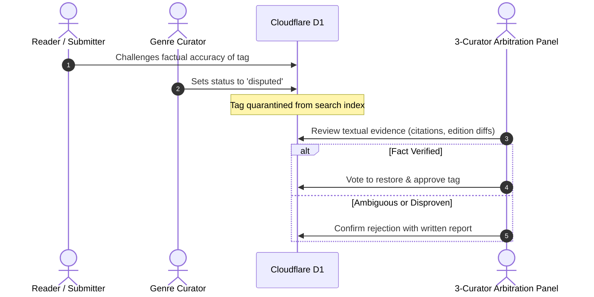

# OpenShelf Moderation Workflow & Tooling Guide

---

## 1. Technical Architecture Overview

To understand your role as a Council Member, it helps to understand the technical boundary between our **curation pipeline** and our **search catalog**.

OpenShelf uses an **isolated dual-database architecture**:

```mermaid
graph TD
    subgraph Edge Layer (Global Readers)
        User[Global Reader / Edge User]
        Worker[Cloudflare Worker<br/>Plain HTML / Sub-50ms TTFB]
        R2[(Cloudflare R2<br/>Immutable SQLite Catalog Dump)]
        User -->|1. Instant Boolean Search| Worker
        Worker -->|Reads Read-Only Index| R2
    end

    subgraph Moderation Layer (Transactional)
        Proposer[Community Member]
        D1[(Cloudflare D1<br/>Moderation Database)]
        VerifyUI[Librarian Queue UI<br/>/verify]
        Council[Library Council Member]
        
        Proposer -->|2. Proposes Tag & Justification| D1
        Council -->|3. Triage & Votes| VerifyUI
        VerifyUI -->|4. Commits Approvals/Vetoes| D1
    end

    subgraph Weekly Offline Compilation Pipeline
        Export[Weekly Batch Export<br/>Approved Tags from D1]
        Pipeline[run_pipeline.sh<br/>8-Stage Data Pipeline]
        NewDB[(New Immutable SQLite DB)]
        
        D1 -->|Sunday 12:00 UTC| Export
        Export --> Pipeline
        Pipeline --> NewDB
        NewDB -->|Deploy Artifact| R2
    end
```

### The Isolation Guarantee
* **Zero Search Pollution**: Nothing submitted by the public ever enters the searchable catalog automatically.
* **Edge Performance**: Public search runs completely read-only against pre-compiled SQLite indexes on Cloudflare R2.
* **Integrity Buffer**: Cloudflare D1 acts as a quarantine and deliberation space where the Council evaluates, disputes, and votes on proposals before anything touches the catalog.

---

## 2. Moderation Database Schema

The Council's actions are recorded in three transactional tables defined in [`db/d1_moderation_schema.sql`](../db/d1_moderation_schema.sql):

### 1. `Pending_Tags`
Holds all incoming community tag proposals submitted through the site:
* `id`: Unique proposal identifier.
* `work_id`: Open Library or LOC work ID (e.g., `ol18438224w`).
* `work_title`: Title of the referenced book.
* `work_isbn`: ISBN-10 or ISBN-13 of the specific edition.
* `proposed_tag_name`: Proposed tag string (e.g., `isolated_setting`).
* `tier`: One of `'thematic'`, `'genre_identity'`, `'genre_trope'`, `'audience'`, or `'language'`.
* `justification`: The submitter's one-sentence textual evidence.
* `status`: Current lifecycle state (`'pending'`, `'approved'`, `'rejected'`, `'disputed'`).

### 2. `Moderation_Log`
An immutable, permanent audit trail recording every action taken by Council members:
* `proposal_id`: Link to the proposal.
* `action`: Action taken (`'approved'`, `'rejected'`, `'disputed'`, `'promoted'`).
* `moderator_id`: Council member identifier.
* `moderator_role`: Role (`'librarian'`, `'council_lead'`, `'admin'`).
* `written_rationale`: Required explanation for any rejection or dispute.
* `action_timestamp`: Exact UTC time of the action.

### 3. `Council_Votes`
Records plenary voting ballots during the weekly Saturday council cycle:
* `cycle_week`: Formatted week identifier (e.g., `'2026-W40'`).
* `proposal_id`: Proposed tag promotion or new thematic tag.
* `tag_name`: Canonical tag name.
* `council_member_id`: Authenticated Council member ID.
* `vote`: One of `'yes'`, `'no'`, `'abstain'`, or `'veto'`.
* `rationale`: **Strictly required by database constraint if vote is `veto`**.

---

## 3. Using the Librarian Verification Queue (`/verify`)

The primary daily workspace for Genre Curators is the **Librarian Verification Queue**, accessible at `/verify` on the OpenShelf deployment (rendered via [`src/ui/pages/verify.js`](../src/ui/pages/verify.js)).

### Reviewing a Proposal Card:
Each submission appears as a distinct review card:

```text
+-----------------------------------------------------------------------+
| Tag: locked_room_puzzle                              Tier: genre_trope |
| Book: The Decagon House Murders                                        |
| ISBN: 9781786580979                                                    |
|                                                                       |
| "A group of university students are isolated on an island where each   |
| murder occurs behind locked, physically barred doors."                 |
|                                                                       |
| [ Approve ]    [ Reject ]    [ Flag as Disputed ]                      |
+-----------------------------------------------------------------------+
```

### Action Protocols:

1. **Verify the Citation**: Read the justification. Does it cite a specific, verifiable premise or structural element in the text?
2. **Check the ISBN/Book**: If the book is unfamiliar, check the Library of Congress catalog, Open Library, or a verified summary.
3. **Approve**: If the tag satisfies our *Fact Over Feeling* doctrine and formatting standards, click **Approve**. 
   - A tag requires **three (3) independent curator approvals** before it transitions from `pending` to `approved`.
4. **Reject**: If the tag is subjective (e.g., `spooky`, `boring`) or malformed, click **Reject**. Provide a brief written reason.
5. **Flag as Disputed**: If the factual basis is contested or unclear, flag it as `disputed`.

---

## 4. The Dispute Protocol

When a tag enters `status = 'disputed'`:



### Quarantine Rule:
Disputed tags are **instantly removed** from active Boolean search queries. We never risk false-positive pollutions of the search space while a debate is underway.

### Arbitration:
A three-member panel of Genre Curators reviews the submitted evidence within 72 hours.
- If verified: The tag returns to `approved`.
- If ambiguous or subjective: The tag is permanently `rejected`.

---

## 5. From D1 to the Edge: The Weekly Build Pipeline

Every Sunday at 12:00 UTC, approved changes transition from the transactional database to the global edge:

1. **Batch Extraction**: An automated script queries `Pending_Tags` where `status = 'approved'` and `updated_at >= datetime('now', '-7 days')`.
2. **Dictionary Synchronization**:
   - Approved keywords are appended to [`src/taxonomy/tags_thematic_keywords.js`](../src/taxonomy/tags_thematic_keywords.js) or `tags_trope_keywords.js`.
   - Seminal work explicit mappings are added to `seed_mappings.js`.
3. **Offline Ingestion Run (`run_pipeline.sh`)**:
   - Stage 1–3: Raw MARC / Open Library normalization.
   - Stage 4–5: Regex dictionary parsing and junction table indexing.
   - Stage 6–7: Vacuuming and compiling into `openedshelf_db_YYYYMMDD.sqlite`.
4. **R2 Edge Deployment**:
   - The compiled SQLite artifact is uploaded to Cloudflare R2 bucket.
   - The edge workers switch read pointers with zero downtime.

As a Council Member, every verification you complete directly shapes this weekly global release!
