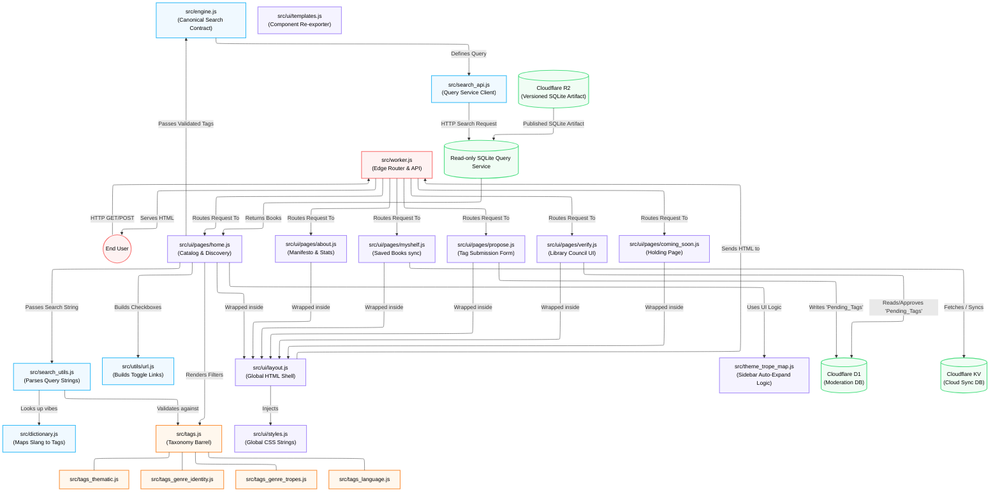

# OpenedShelf Architecture Map

This comprehensive map details every file in the OpenedShelf project, split into two distinct ecosystems: **1. The Live End-User Application** and **2. The Offline Data Pipeline**.

---

## 1. The End-User Application (Edge & UI)

This section details how the live web application serves users, renders the UI, and queries the database.

### The Request Lifecycle & UI Generation



### File-by-File Breakdown: UI & Edge Logic
* **`src/worker.js`**: The central nervous system. Routes requests, fetches tag counts, and calls UI page renderers.
* **`src/ui/layout.js` & `src/ui/styles.js`**: The global HTML shell and template-literal CSS.
* **`src/ui/templates.js`**: Re-exports all page renderers.
* **`src/ui/pages/home.js`**: Renders the main catalog and tag sidebar.
* **`src/theme_trope_map.js`**: Used heavily by `home.js` and `templates.js` to dynamically auto-expand parent categories in the sidebar when child tags are selected.
* **`src/ui/pages/propose.js`, `verify.js`, `myshelf.js`, `about.js`, `coming_soon.js`**: Specific route renderers.
* **`src/search_utils.js`, `dictionary.js`, `engine.js`**: The logic layer that parses input and defines the canonical search contract and SQL used by the query service.
* **`src/search_api.js`**: The Worker client for the read-only SQLite query service. It preserves the existing result shape, counts, Rabbit Hole checks, and fallback behavior.
* **`src/tags*.js`**: The static arrays defining all 877 taxonomy tags used for UI and validation.

---

## 2. The Offline Data Pipeline (Build Time)

This pipeline runs locally to transform the massive OpenLibrary data dump into the optimized SQLite artifact. The artifact is published to R2 and synchronized by the read-only query service; moderation data remains in D1.

```mermaid
config:
  layout: elk
graph TD
    classDef pipeline fill:#f0fdf4,stroke:#4ade80,stroke-width:2px,color:#000000;
    classDef config fill:#f0f9ff,stroke:#38bdf8,stroke-width:2px,color:#000000;
    classDef data fill:#fff7ed,stroke:#fb923c,stroke-width:2px,color:#000000;
    
    OL[("OpenLibrary Data Dump<br/>(ol_dump_latest.txt.gz)")]:::data
  Pipeline["build/v2/scripts/run_pipeline.sh<br/>(8-Stage Orchestrator)"]:::pipeline
    DB[("Local SQLite DB<br/>(openedshelf_master.sqlite)")]:::data
    R2Publish["publish_r2_database.sh<br/>(R2 publication)"]:::pipeline

    OL --> Pipeline
    Pipeline -->|Stage 1: Extraction| Meta["build/v2/scripts/tag_dump_meta.js"]:::pipeline
    
    Pipeline -->|Stage 2: Assembly| Assembly["build/v2/scripts/tag_dump_assembly.mjs"]:::pipeline
  
    Pipeline -->|Stage 3: Identity| Identity["build/v2/scripts/tag_dump_identity.js"]:::pipeline
    Pipeline -->|Stage 4: Tropes| Tropes["build/v2/scripts/tag_dump_trope.js"]:::pipeline
    Pipeline -->|Stage 5: Clean| Clean["build/v2/scripts/tag_dump_clean.js"]:::pipeline
    Pipeline -->|Stage 6: Thematic| Thematic["build/v2/scripts/tag_dump_thematic.js"]:::pipeline
    Pipeline -->|Stage 7: Counts| Counts["build/v2/scripts/tag_dump_counts.mjs"]:::pipeline

    Meta --> DB
    Assembly --> DB
    Identity --> DB
    Tropes --> DB
    Clean --> DB
    Thematic --> DB
    Counts --> DB
    
    DB -.->|Published as versioned artifact| R2Publish
    R2Publish --> R2
```

### File-by-File Breakdown: The Build Pipeline
* **`build/v2/scripts/run_pipeline.sh`**: The orchestrator that runs the 8-stage script sequence with hardware cooldowns.
* **Stage 1 (`tag_dump_meta.js`)**: Streams the massive `.txt.gz` file in a 3-pass sequence. Builds a persistent `authors_map.db` from `/type/author` records, extracts `/type/work` records using the mapped authors, and processes `/type/edition` for fallbacks.
* **Stage 2: Schema & Base Taxonomy Assembly**:
  * **`src/schema.sql`**: The raw SQL used to create the `Works`, `Tags`, `Works_Tags`, and `Pending_Tags` tables in the local SQLite file.
  * **`build/v2/src/utils/seed_base_tags.js`**: Populates the `Tags` table with the official base taxonomy schemas (genres, tropes, languages) derived from the `tags_*.js` config files.
  * **`build/v2/src/seed_mappings.js`**: Contains the explicit SQL mappings used by downstream scripts (`tag_dump_identity.js` and `tag_dump_trope.js`) to identify and grant tags to seminal works.
* **Stages 3-6 (`tag_dump_identity.js`, `_trope.js`, `_clean.js`, `_thematic.js`)**: Executes the SQL and regex rules to classify all extracted books, then purges millions of orphans to save space. Stage 6 uses `src/theme_trope_map.js` for 1-to-many tag cascades and both `src/tags_thematic_keywords.js` and `src/tags_trope_keywords.js` as dynamic regex fallback dictionaries. Stage 3 (Identity) uses `src/tags_identity_keywords.js` as its regex fallback dictionary.
* **Stage 7 (`tag_dump_counts.mjs`)**: Bakes the exact frequency count of every tag statically into the database.
* **Standalone D1 Moderation Deployment Engine (`deploy_d1.sh`)**:
  * **`build/v2/scripts/prepare_deploy_db.js`**: Generates `openedshelf_d1_prod.sqlite` and nullifies raw offline staging columns (`ol_subjects`, `ol_genres`) to save ~8–10 GB while preserving 100% of books and tag mappings.
  * **`build/v2/scripts/chunk_master_db.js`**: Partitions the production SQLite database into 15 MB SQL transaction files (`chunk_0001.sql`) with 10,000-row `BEGIN TRANSACTION ... COMMIT;` blocks.
  * **`build/v2/scripts/deploy_d1.sh`**: Standalone orchestrator that backs up community `Pending_Tags`, runs database optimization and chunking, uploads chunks via `npx wrangler d1 execute`, and restores community proposals.
* **R2 Catalog Publication (`publish_r2_database.sh`)**:
  * Publishes the versioned SQLite artifact from `db/openedshelf_db_08_2026.sqlite` to the `SEARCH_DATABASE` R2 bucket.
  * The query service synchronizes the active artifact locally and exposes `/search` and `/tag-counts` to the Worker.

---

## 3. Legacy / Dead Code
* **`src/adapter.js`**: An old OpenLibrary API fetcher. The changelog notes this was removed/archived on May 23, but it still exists in the `src/` directory. It is not currently executed by the Edge UI or the Offline Pipeline.
* **`src/templates.js`**: A legacy barrel file preserved solely to prevent breaking backward compatibility with older `worker.js` imports. The modern UI uses `src/ui/templates.js`.

